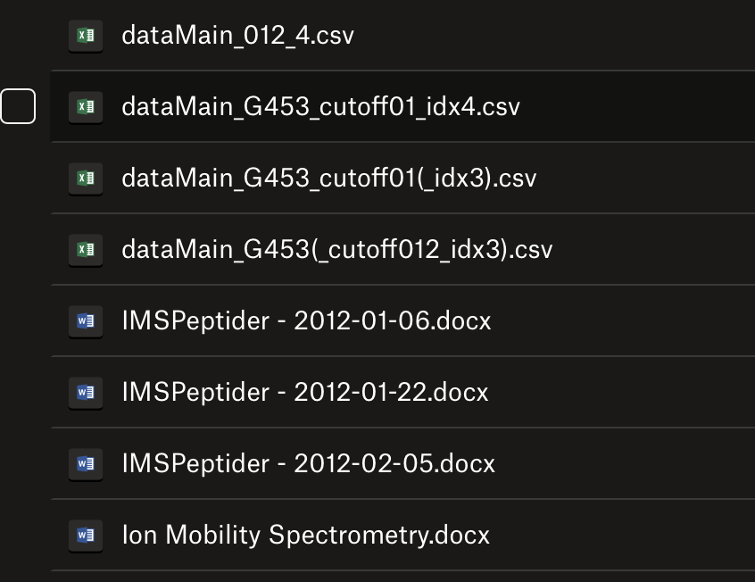
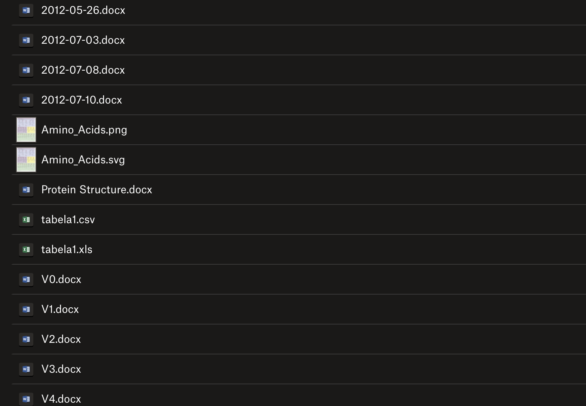
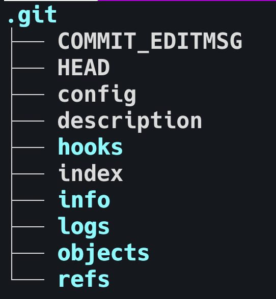
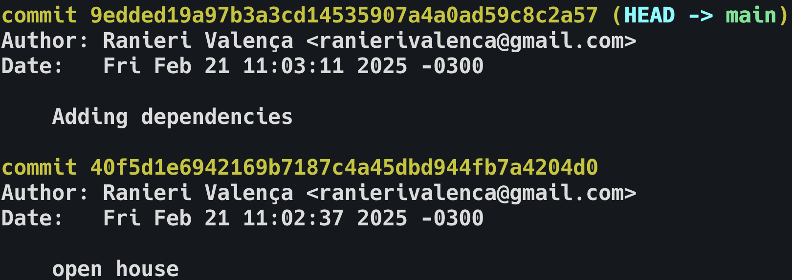
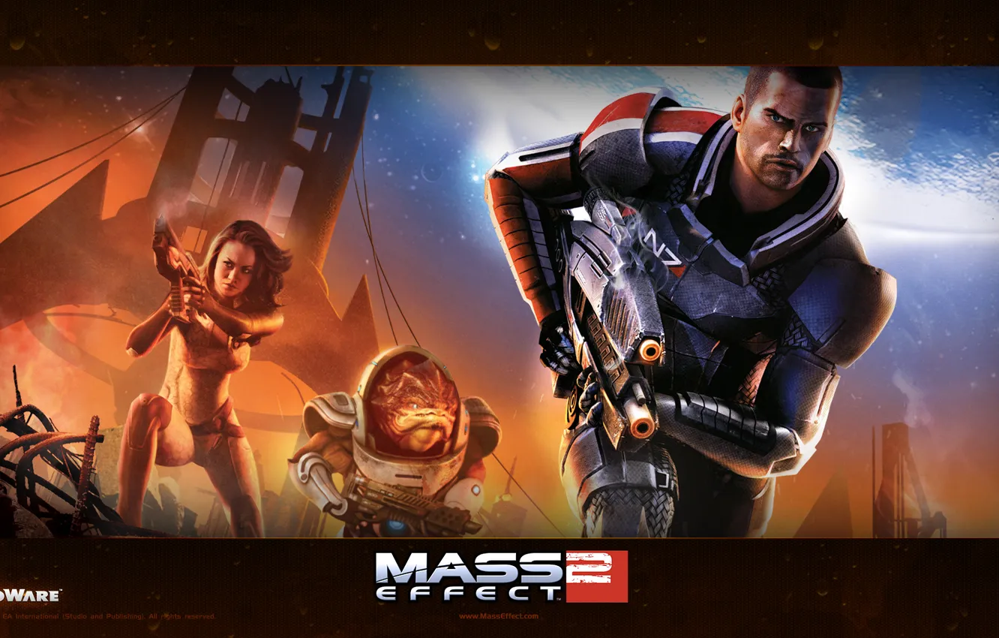
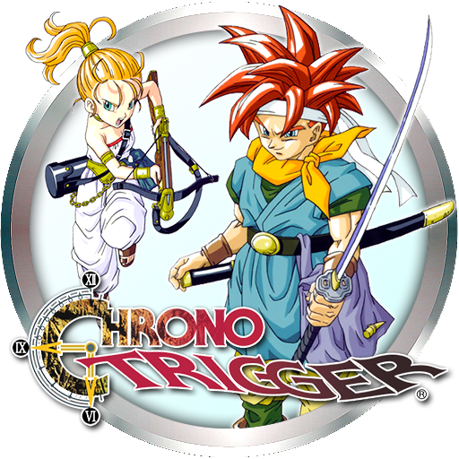

## **Sistemas de Controle de Versão**
# **`git`**
_Zero to Hero_


## Começando...





### O que são sistemas de controle de versão?
- Ferramentas para gerenciar alterações em arquivos ao longo do tempo
- Permitem colaboração, histórico e recuperação de versões antigas
- Fundamentais para qualquer projeto que envolva evolução constante de código ou conteúdo, de qualquer tipo

### Do que vamos falar
- (Tentar) demonstrar por que controle de versão é tão importante no desenvolvimento de software
- Conhecer a evolução histórica (CVS, SVN, Git)
- Explorar conceitos básicos e avançados de Git
- Apresentar boas práticas e ferramentas úteis
- Incluir demonstrações práticas e estratégias de colaboração


## De onde viemos... Pra onde vamos?

### RCS e CVS
- Primeiras ferramentas focadas em armazenar **diffs** de arquivos
- **Centralizados** e limitados para colaboração paralela
- Permitiram dar os primeiros passos para se gerenciar versões, mas eram pouco flexíveis para se trabalhar em equipes

### SVN
- Modelo centralizado com melhorias sobre o CVS
  - **Branches** e tags mais fáceis de gerenciar
  - Melhor controle de **versões de diretórios**
- Dependência de um servidor único que dificultava o trabalho offline
- Ainda é usado em alguns projetos legados e em empresas que não migraram para Git

### Git
- Criado por Linus Torvalds para o **Kernel Linux**
- **Modelo distribuído**: cada usuário tem cópia completa do repositório
- Alta eficiência e velocidade em operações locais
  - **Branches** e **merges** rápidos
  - Histórico completo **localmente**
  - grep, log, bisect, etc. em [mili]segundos
- **GitHub** (2008) popularizou o Git para projetos open source

### Ferramentas atuais
- Plataformas de colaboração
  - GitHub, GitLab, Bitbucket, Azure DevOps, etc
- Code review, issues, pull requests, etc
- Ferramentas visuais (Sourcetree, GitKraken, TortoiseGit, VS Code integrado, etc)
- Git + plataformas = ecosistema que viabiliza desenvolvimento colaborativo moderno

### Outros tipos de controle de versão
- Plataformas que mantêm histórico de alterações e permitem colaboração
  - Google Docs para documentos
  - Trello para gerenciamento de tarefas
  - Figma para design
- Importante para colaboração e rastreamento de mudanças
- Multiprofissional: não apenas para desenvolvedores


## **Git** from zero

#### Antes, porém...
Uma pequena história sobre o fluxo de trabalho de um desenvolvedor de software

### Working Directory
- Pasta local onde você edita arquivos
- É o “ambiente de trabalho” onde as mudanças efetivamente acontecem

### Repositório
- Local onde o histórico de versões é armazenado
- Contém informações sobre commits, branches, tags, etc
- O termo pode ser usado para a versão local ou remota do projeto

### Repositório Local
- Cada desenvolvedor tem uma cópia completa do repositório
- Histórico de commits, branches, tags, etc
- Localizado na pasta do projeto, dentro da pasta `.git`




### Repositório Remoto
- Cópia do repositório local em um servidor
- Permite colaboração entre desenvolvedores
- Centraliza o código e serve como backup
- Pode estar em plataformas na nuvem (GitHub, GitLab, Bitbucket) ou em servidores locais

### Stage
- Área intermediária entre o **working directory** e o **repositório**
- Permite selecionar quais mudanças serão incluídas no próximo commit
- O comando `git add` move mudanças do **working directory** para o **stage**

### Tracked x Untracked
- *Tracked:* Git já monitora mudanças
- *Untracked:* arquivos ainda não adicionados ao repositório
- O comando `git add <arquivo>` move mudanças do **working directory** para o **stage**
- `.gitignore` para arquivos e pastas que não devem ser rastreados
  - Arquivos temporários, logs, arquivos de build, dependências, etc

### Commits
- "*Fotografias*" do projeto em um momento específico
- Salvam as mudanças adicionadas ao **stage** com alguns metadados
  - **Hash**, autor, data e mensagem
- Importante usar mensagens de commit claras e descritivas
- `git commit -m "mensagem do commit"` para criar um commit



### Branches
<div class="r-stack">
  
  
  
</div>

### Branches
- Permitem desenvolvimento paralelo
- Branch principal: `main` ou `master`
- Cada branch é uma linha de desenvolvimento independente, com seu próprio histórico
- `git branch <nome>` para criar uma nova branch
- 

### Referências da Linha do Tempo
- **HEAD**: ponteiro para o commit atual
- **master** / **main**: ponteiro para o último commit da branch principal
- **my-little-sweet-branch**: ponteiro para o último commit da branch `my-little-sweet-branch`
- **`~`** e **`^`** para referenciar commits anteriores
  - `main^` para o penúltimo commit da branch `main`
  - `HEAD~3` para o terceiro commit anterior ao HEAD
- **Hash do commit**: identificador único de cada commit
- `git checkout <hash>` para navegar diretamente para um commit específico


### Merge e Rebase
<div class="r-stack">
  
  
  
</div>

### Merge e Rebase
- **Merge**: mescla alterações de uma branch em outra
  - **Fast-forward**: quando não há conflitos
  - **3-way merge**: quando há conflitos 🙈
- **Rebase**: rearranja commits, mantendo histórico linear
  - Útil para manter histórico limpo
  - Cuidado ao reescrever histórico em branches compartilhadas (repositórios remotos)


## Git - Comandos Básicos

### Configuração Inicial
<!-- - `git config -[-global] user.name "Seu Nome"`
- `git config -[-global] user.email "Seu Email"`
- `git config -[-global] core.editor "Seu Editor Preferido"`
    - nano, vim, code, notepad++, etc
- `git config -[-global] color.ui auto`
- `git config -[-global] alias.st status` -->
```bash
# define nome de usuário
git config --global user.name "Seu Nome"
```
<!-- .element class="fragment" type="text/template" -->
```bash
# define email de usuário
git config --global user.email "Seu Email"
```
<!-- .element class="fragment" -->
```bash
# define editor padrão
# ex: code, vim, nano, notepad++
git config --global core.editor "Seu Editor Preferido"
```
<!-- .element class="fragment" -->
```bash
# ativa cores na saída do Git
git config --global color.ui auto
```
<!-- .element class="fragment" -->
```bash
# cria alias para comando
git config --global alias.st status
```
<!-- .element class="fragment" -->


### Inicialização de Repositório
<!-- - `git init`: inicia um repositório local
- `git clone <url>`: clona um repositório remoto -->
```bash
# inicia um repositório local
git init
```
<!-- .element class="fragment" type="text/template" -->
```bash
# clona um repositório remoto
git clone <url>
```
<!-- .element class="fragment" -->

### Comandos Básicos dentro do Repositório
<!-- - `git status`: exibe o estado atual do repositório
- `git add <arquivo>`: adiciona mudanças ao stage
    - `git add .` adiciona todas as mudanças
    - `git add -p` permite adicionar partes específicas de arquivos
- `git commit -m "mensagem"`: cria um commit
- `git fetch`: busca mudanças do repositório remoto -->
```bash
# exibe o estado atual do repositório
git status
```
<!-- .element class="fragment" type="text/template" -->
```bash
# adiciona mudanças ao stage
# ex: git add README.md
git add <arquivo>
```
<!-- .element class="fragment" -->
```bash
# cria um commit
git commit -m "mensagem"
```
<!-- .element class="fragment" -->
```bash
# busca mudanças do repositório remoto
git fetch
```
<!-- .element class="fragment" -->

### Mais Comandos Básicos
<!-- - `git merge <branch>`: mescla mudanças de outra branch
- `git rebase <branch>`: reorganiza commits para manter histórico linear
- `git push`: envia commits para o repositório remoto
- `git pull`: atualiza o repositório local com as mudanças do remoto
    - Equivalente a `git fetch` + `git merge`
    - `git pull --rebase` para rebase em vez de merge -->
```bash
# mescla mudanças de outra branch
git merge <branch>
```
<!-- .element class="fragment" type="text/template" -->
```bash
# reorganiza commits para manter 
# histórico linear
git rebase <branch>
```
<!-- .element class="fragment" -->
```bash
# envia commits para o repositório remoto
git push
```
<!-- .element class="fragment" -->
```bash
# atualiza o repositório local 
# com as mudanças do remoto
git pull
```
<!-- .element class="fragment" -->
```bash
# rebase em vez de merge
git pull --rebase
```
<!-- .element class="fragment" -->

### Comandos Básicos de Histórico
<!-- - `git log`: exibe histórico de commits
    - `git log --oneline` para exibir em uma linha
    - `git log --graph` para exibir em formato de grafo
- `git diff`: exibe diferenças entre arquivos
    - `git diff <arquivo>` para exibir diferenças de um arquivo específico
    - `git diff <commit> <commit>` para exibir diferenças entre commits -->
```bash
# exibe histórico de commits
git log
```
<!-- .element class="fragment" type="text/template" -->
```bash
# exibe histórico de commits em uma linha
git log --oneline
```
<!-- .element class="fragment" -->
```bash
# exibe histórico de commits em formato de grafo
git log --graph
```
<!-- .element class="fragment" -->
```bash
# exibe diferenças entre arquivos
git diff
```
<!-- .element class="fragment" -->
```bash
# exibe diferenças de um arquivo específico
git diff <arquivo>
```
<!-- .element class="fragment" -->
```bash
# exibe diferenças entre commits
git diff <commit> <commit>
```
<!-- .element class="fragment" -->

### Comandos Básicos de Branches
<!-- - `git branch`: exibe lista de branches
- `git branch <nome>`: cria uma nova branch
- `git checkout <branch>` / `git switch <branch>`: muda para uma branch
- `git checkout -b <branch>` / `git switch -c <branch>`: cria e muda para uma branch
- `git checkout -B <branch>` / `git switch -C <branch>`: força a criação e mudança para uma branch, sobrescrevendo se existir
- `git branch -d <branch>`: deleta uma branch -->
```bash
# exibe lista de branches
git branch
```
<!-- .element class="fragment" type="text/template" -->
```bash
# cria uma nova branch
git branch <nome>
```
<!-- .element class="fragment" -->
```bash
# muda para uma branch
git checkout <branch> # git switch <branch>
```
<!-- .element class="fragment" -->
```bash
# cria e muda para uma branch
git checkout -b <branch> # git switch -c <branch>
```
<!-- .element class="fragment" -->
```bash
# força a criação e mudança para uma branch
# sobrescrevendo se existir
git checkout -B <branch> # git switch -C <branch>
```
<!-- .element class="fragment" -->
```bash
# deleta uma branch
git branch -d <branch>
```
<!-- .element class="fragment" -->


## Boas Práticas de Commit (Git Semântico)

### Commits Semânticos (Conventional Commits)
- `feat: ...` (nova funcionalidade)
- `fix: ...` (correção de bug)
- `docs: ...` (mudança de documentação)
- `refactor: ...` (refatoração sem mudar comportamento)
- `style: ...` (formatação, identação, etc.)
- `test: ...` (adições/alterações de testes)
- Exemplo: `feat: adicionar login` ou `fix: corrigir bug de validação`

### Mensagens Claras
- Primeira linha: resumo do que foi feito
- Corpo opcional (quebra de linha após a primeira linha): “por que” a mudança foi feita, detalhes adicionais
- **Commits pequenos e frequentes facilitam revisão e reduzem conflitos**
> commit early, commit often


## Fluxos de Trabalho (Workflows)

### Git Flow
- Uso de branches fixas:
  - `main/master`: produção
  - `develop`: integração de features
  - `feature/`: novas funcionalidades
  - `release/`: preparação para release
  - `hotfix/`: correções rápidas
- Bom para projetos com ciclos de release mais formais
- Pode ser mais complexo, porém traz organização clara para releases

### GitHub Flow
- Apenas branch principal (produção) + branches de feature
- Pull requests para integrar mudanças
- Simples, adequado a times que liberam mudanças continuamente

### Trunk-Based Development
- Uma única branch de integração constante (geralmente `main`)
- Merges frequentes e uso de feature flags para habilitar/desabilitar funcionalidades em produção
- Favorável a cenários de entrega contínua (CD)


## Ferramentas Visuais

### Sourcetree
- Interface amigável, ótimo para visualizar histórico, commits e merges
- Suporta Git e Mercurial, tornando-o versátil em alguns projetos
- Disponível para Windows e Mac

<!-- .slide: data-transition="convex" -->
### Sourcetree


### GitKraken
- Visual moderno, funcionalidades de colaboração (Kanban board em algumas versões)
- Facilita a gestão de branches, commits e merges com interface intuitiva
- Disponível para Windows, Mac e Linux
- Versão gratuita para uso pessoal com limitações

<!-- .slide: data-transition="convex" -->
### GitKraken


<!-- .slide: data-transition="convex" -->
### GitKraken


### TortoiseGit (Windows)
- Integração com o Windows Explorer, popular para quem está acostumado com TortoiseSVN
- Prático para usuários de Windows que preferem interface sem abrir terminal
- Facilita operações básicas de Git sem sair do Explorer
- Disponível apenas para Windows

<!-- .slide: data-transition="convex" -->
### TortoiseGit


### VS Code (Integração Git)
- Possibilita visualizar alterações, commits e merges sem sair do editor
- Extensões adicionais ajudam na automação de tarefas (lint, formatação)
- Integração com GitHub, GitLab e Bitbucket
- Disponível para Windows, Mac e Linux

<!-- .slide: data-transition="convex" -->
### VS Code (Integração Git)


## Recursos Avançados e Funcionalidades Extras

### Cherry-Pick
- Aplica um commit específico em outra branch, sem trazer o histórico completo
- Útil para correções rápidas ou para levar uma funcionalidade específica para outra branch
- `git cherry-pick <ref-do-commit>`
- Cuidado com conflitos e possíveis quebras de código

### Revert e Reset
- **Revert**: cria um *novo commit* que desfaz mudanças (preserva histórico)
- **Reset**: *altera o ponteiro* do repositório para um commit anterior (**pode apagar histórico local**)
- Cuidado ao usar `reset --hard`, especialmente se for repositório compartilhado
- Úteis para corrigir erros ou desfazer mudanças
- `git revert <ref-do-commit>` e `git reset --hard <ref-do-commit>`
- `reset --soft` mantém mudanças no stage

### Stash
- Evita criar commits sem foco ou poluir o histórico
- Útil para mudar rapidamente de contexto sem perder trabalho
- Pode ser usado para guardar mudanças inacabadas e retomar depois
- `git stash`: guarda temporariamente mudanças não commitadas
  - `git stash -u` para incluir arquivos não rastreados
- `git stash pop`: restaura as mudanças
- `git stash list` para ver lista de stashes
- Também tem suporte a referências (por exemplo, `stash@{2}`)

### Bisect
- Busca binária para encontrar qual commit introduziu um bug
- Marca commits como “bom” ou “ruim” e filtra o histórico
- Ótimo para projetos grandes ou bugs antigos difíceis de localizar manualmente
- `git bisect start`, `git bisect good`, `git bisect bad`, `git bisect reset`
- `git bisect run <comando>` para automatizar a busca
- Requer conhecimento do estado do projeto em diferentes commits

### Interactive Rebase
- `git rebase -i`: editar, reordenar ou juntar (squash) commits
- Mantém o histórico limpo e coerente
- Útil para limpar commits antes de compartilhar com outros
- Útil para alterar mensagens de commit, juntar commits pequenos, reordenar commits, descartar commits
- Use com cautela para não reescrever histórico já enviado a outras pessoas
- `git rebase -i HEAD~3` para interagir com os últimos 3 commits

### Hooks (pre-commit, commit-msg, etc.)
- Scripts que rodam em eventos
- Valida formato de mensagem, executa lint/testes, etc
- Fundamental para times que querem padronizar commits e evitar problemas
- Exemplos: `pre-commit`, `commit-msg`, `pre-push`
- `.git/hooks/` 
  - cada hook tem um exemplo para renomear e ativar

### Git LFS (Large File Storage)
- Tratamento especial para arquivos grandes (imagens, binários)
- Evita inchar o histórico principal
- Integra-se bem com GitHub e outras plataformas
- `git lfs track "*.jpg"` para rastrear arquivos grandes
- Requer instalação do Git LFS e configuração inicial

### Submodules e Subtrees
- **Submodules**: incorporar outro repositório Git em um subdiretório
- **Subtrees**: alternativa mais simples em certos casos, “mesclando” conteúdos
- Úteis para projetos que compartilham bibliotecas ou módulos internos
- Também bastante útil para agrupar repositórios em um só (monorepos)
- Cuidado com complexidade e possíveis conflitos

### Submodules e Subtrees
- `git submodule add <url>` para adicionar um submodule
- `git subtree add --prefix <prefix> <url> <branch>` para adicionar subtree
- `git submodule update --init --recursive` para clonar submódulos
- `git subtree pull --prefix <prefix> <url> <branch>` para atualizar subtree
- `git submodule update --remote` para atualizar submódulos


## **CI** (Integração Contínua) & **CD** (Entrega Contínua)

### CI
- Continuously Integrates (Integração Contínua)
- Feedback rápido sobre qualidade do código
- Ferramentas como GitHub Actions, GitLab CI, Bitbucket Pipelines
- Executam testes, lint, build a cada push/merge request
- Alertam falhas rapidamente, garantindo qualidade contínua

### CD
- Continuously Deploys (Entrega Contínua)
- Deploy automático após aprovação/testes bem-sucedidos
- Foco em entregar valor de forma rápida e confiável
- Exige boa organização de features e cuidado com configurações de ambiente


## Demonstração Prática (Hands-On)

1. **Criação de Repositório**
   - No GitHub/GitLab, crie um repositório vazio
   - Escolha se deseja um README inicial ou .gitignore

2. **Clone Local**
   - `git clone <url>`
   - Verifique se o repositório clonado contém arquivos básicos, caso tenha um README

3. **Criar/Editar Arquivos**
   - Criar `README.md` com uma breve descrição
   - Inserir alguma informação relevante do projeto

4. **Stage e Commit**
   - `git add .` e `git commit -m "feat: adicionar README"`
   - Verifique o estado com `git status`

5. **Push**
   - `git push -u origin main`
   - A branch principal passa a ser rastreada localmente

6. **Criar Branch de Feature**
   - `git checkout -b feature/login`
   - Faça alterações, adicione e commit

7. **Exemplo de Conflito**
   - Edite a mesma linha em duas branches diferentes

8. **Merge**
   - Merge via linha de comando
   - Resolva eventuais conflitos e finalize o merge

9. **Exemplo de Rebase**
   - `git rebase main` em uma branch para mostrar como “linearizar” commits


## Mais Exemplos Práticos

### Exemplo de Resolução de Conflito
- Deliberadamente alterar a mesma linha em duas branches
- `git merge feature-X` → conflito
- Exibir markers (`<<<<<<<`, `=======`, `>>>>>>>`) e resolver

### Usando Stash para Trocar de Tarefa
- `git stash` para guardar mudanças inacabadas
- Mudar para outra branch, fazer alterações, voltar e `git stash pop`
- Fluxo essencial para quem lida com interrupções frequentes


## Boas Práticas e Equívocos Comuns

- **Forçar Push (`git push --force`)**
  - Use com extremo cuidado; pode sobrescrever histórico no repositório remoto
- **Commits Gigantes**
  - Dificultam a revisão. Prefira commits menores e objetivos
- **Branches Enormes e de Longa Duração**
  - Deixe branches menores e faça merges frequentes para evitar conflitos grandes
- **Mensagens de commit vagas**
  - Prejudicam a leitura do histórico. Use descritivos claros


## Dicas de Organização e Produtividade

- **Commits e Pull Requests Frequentes**
  - Evita grandes merges e facilita code review
- **Naming Conventions para Branches**
  - `feature/`, `bugfix/`, `release/`, `hotfix/`, etc
- **Integração Contínua**
  - Mantenha pipelines com testes confiáveis
  - Feedback rápido sobre a qualidade do código
- **Automatize com Hooks**
  - Forçar formatação de código, convenções de commits, testes básicos pré-commit


## Hoje em dia

- **GitOps**
  - Uso do Git para gerenciar configurações de infraestrutura (Kubernetes, Docker, etc.)
- **DevSecOps**
  - Integração de segurança no pipeline (verificações de vulnerabilidades, SAST/DAST)
- **Monorepos / Multirepos**
  - Estratégias para lidar com vários projetos em um só repositório ou repartidos
- **Sparse Checkout**
  - Clonar apenas parte do repositório (útil em monorepos gigantes)


## Referências e Materiais de Estudo

- **Pro Git (Scott Chacon & Ben Straub)**
  - [https://git-scm.com/book/en/v2](https://git-scm.com/book/en/v2)
- **Documentação Oficial do Git**
  - [https://git-scm.com/docs](https://git-scm.com/docs)
- **Conventional Commits**
  - [https://www.conventionalcommits.org/](https://www.conventionalcommits.org/)
- **Tutoriais Atlassian**
  - [https://www.atlassian.com/git](https://www.atlassian.com/git)
- **GitHub Learning Lab**
  - [https://lab.github.com/](https://lab.github.com/)
- **Learn Git Branching**
  - [https://learngitbranching.js.org/](https://learngitbranching.js.org/)


## Perguntas?